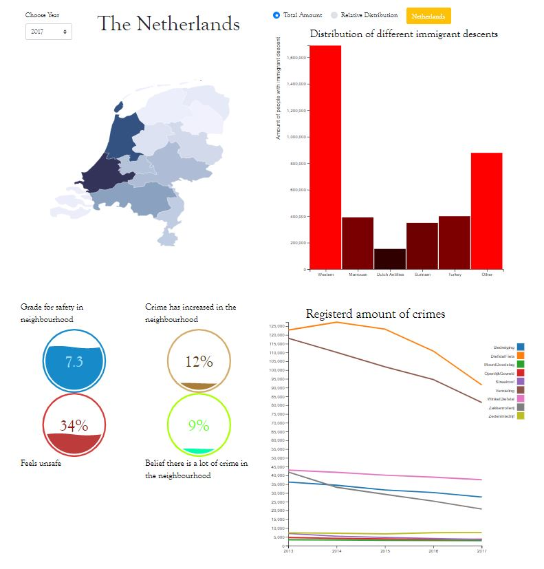

# Programming Project - Migration & Crime in the Netherlands

---

##### ***Name***: David Mokken
##### ***Course***: Minor Programming
##### ***Student number***: 10770798

---

***__Problem Statement__***
---
We live in times where people are afraid, especially of people who are different or come from another place than ours. This in combination with lack of knowledge of the actual numbers of crime, asylum seekers and migrants have lead to forgone conclusions and fear/anger in many people towards "foreigners". 

**Solution**
This application was created with to provide proper and easy to understand visualisations of data concerning crimerates, migrants and ethnicity which hopefully might change people's perceptions about migrants. A more detailed description of the case is provided on the site or in the README.md.

***__High Level Overview__***
---
**Dashboard Components**
The visualization consists of the following components:

* Every html webpage contains a fixed navbar at the top with 5 navigational
links, the first is a picture of a David that also links to the homepage. A footer at the bottom and a title with favicon symbol of a scale. 

* Every page contains a large image to attract attention the my case. Every image contains a title and a link button to another site.

* Four D3 visualizations:
All (interactive) visualizations are included with an on click function, colors
representing the values (except line chart) and a tooltip.
  - Datamap
  - Line chart (includes button to start animation of drawing line chart)
  - Horizontal bar chart
  - Fillgauge

***__Technical Design__***
---
**HTML, Bootstrap & CSS**
The website in its entirety consists out of 4 HTML-files. One for each page of the website; the homepage (index.html), the case description page (about.html), the visualisations page (visualizations.html) and lastly, the additional information page (information.html). 
In these files a lot of Bootstrap and CSS is used for the visual aspect of the pages. The pages are linked to each other with the help of a navigation bar or links in the pages. The hero-images provide a nice visual aspect that grabs the attention of the reader. Also a footer was included to provide my contact info to possible readers/users. 
There are certain elements such as the dropdown, radio button, and label that actually interactive with the data and therefore are changeble by user action. Apart from a seperate style file, I have chosen to sometimes style in the html tags as it gave me a clearer and better insight in all the different several grid objects in terms of spacing and color.

**Python**
I used python and pandas to convert my csv data into a json file. This actually took some time as there were certain steps that needed to be taken before I could succesfully converted into a json. I had chosen for a multi-index dataframework in pandas in which I could more easily change the names of the columns and have more clear vision over my data. However, this could not be converted directly into a nested json. Therefore, I had to create a 2 layered nested dict from the multi-index dataframework. After this step I could succesfully push the dict into a nested json file.

**Javascript**
In this repository I have made a distinction between personally created JavaScript files and externally (and slightly modified) Javascript files. The external JavaScript files are the D3 library files and the Fillgauges. The Fillgauge files are complicated files and are therefore slightly modified to be properly used. I, myself, wrote scripts for the barchart, map function and linechart.

* datamap.js: This script loads all the converetd datafiles and creates a datamap using a TopoJSON-file. It holds a hoover function for the datamap and is color scaled. It connects all the other visualisation by linking the seperate datafiles to a on-click function for provinces and value change functions for the radio button and dropdown. Furthermore, a function is created for the update when the user clicks on the Netherlands button. A start function is also created that shows the data for the Netherlands in 2017 when starting the program. 

* barchart.js: The top right shows a barchart which shows the distribution of the different immigrants descents per province. The radio button changes the barchart from a total amount of distribution to a relative distribution. There is a Netherlands button that once clicked changes all the chart to show information about the Netherlands as a whole. A hoover function is installed to show the precise amount in the barchart. The bars are color coded to the amount of percent with the darker color showing the lesser amount. 
  
* linechart.js: The bottom right shows a linechart that shows amount of registered crimes over 5 years in a given province. Several different crimes were picked that were hidden in the report that was mentionned in the case. The linechart reacts to the province chosen/clicked in the map.

**Data**

***__Challenges__***
---
Clearly describe challenges that your have met during development. Document all important changes that your have made with regard to your design document (from the PROCESS.md). Here, we can see how much you have learned in the past month.

***__Defence__***
---
Defend your decisions by writing an argument of a most a single paragraph. Why was it good to do it different than you thought before? Are there trade-offs for your current solution? In an ideal world, given much more time, would you choose another solution?

Make sure the document is complete and reflects the final state of the application. The document will be an important part of your grade.
